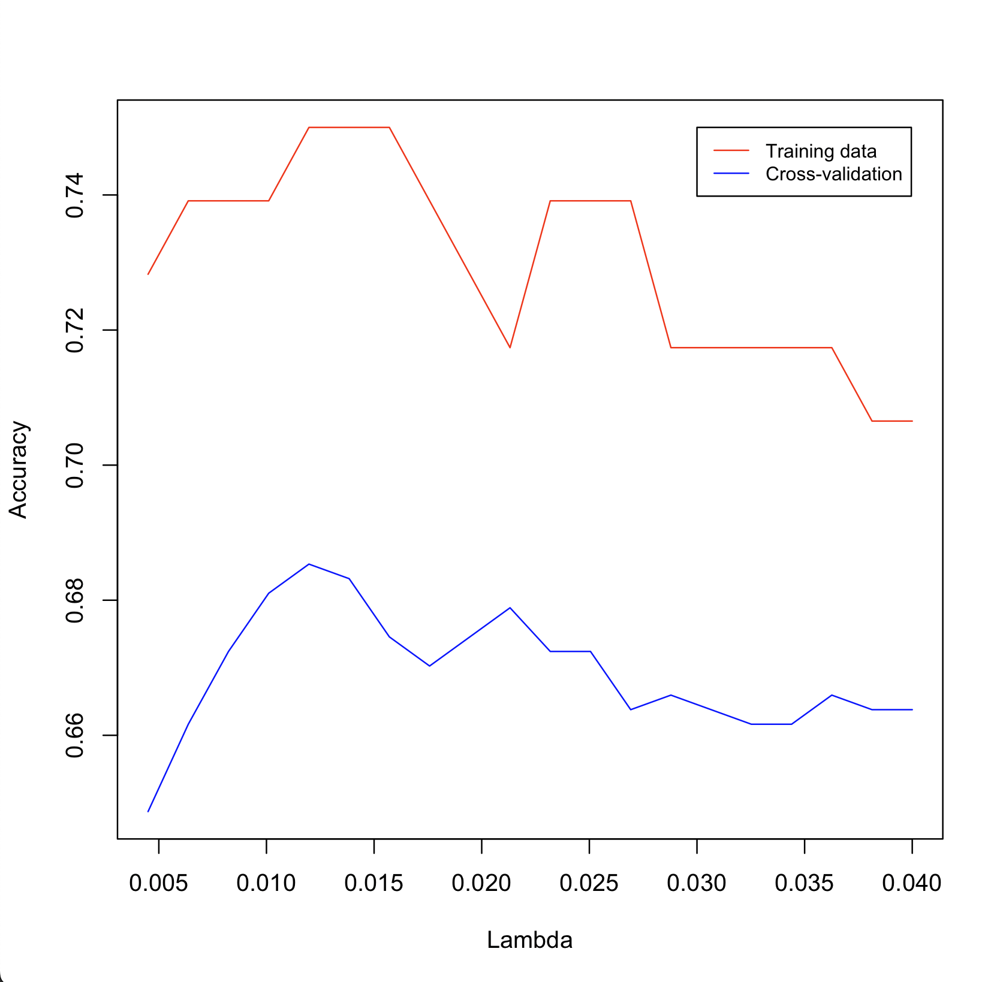

$\newline$
$\newline$

**Grade suggestion: 4**

# 1. Introduction

In this report we present an R implementation of a multi-class classifier to predict if different types of new particle formation (NPF) events occur on a given day. An NPF event happens, when smaller particles start to form larger particles that affect cloud formation [@kerminen2018atmospheric]. There are three types of NPF events: Ia, Ib and II [@kerminen2018atmospheric]. There is also a possibility that an NPF event does not happen on a given day.

The objective of this report is to present a classifier to solve the aforesaid task and analyze the results critically. We chose as our classifier a multi-class classifier that uses logistic regression with RIDGE regularization. The classifier was trained on a dataset containing various atmospheric parameters (such as temperature, CO2 measurements, etc.) on multiple days throughout the years 2000-2011. 

Our final model managed to get an accuracy of $0.75$ on validation data randomly chosen from the given training data and a 5-fold cross-validation accuracy of $0.6857$ calculated on the complete training data. 

The contents of the report are as follows. First, we discuss the methods we used to choose the classification model, explain the concept of linear regression briefly and go through what kind of feature selection was done. Secondly, we analyze the results of our classifier. Lastly, we conclude the analysis, discuss the results and provide ideas what could be done to improve the classification results.


# 2. Methods Used

Firstly, it is important to note that since the beginning of this project, we were aware of how limited time we have available for this project. This time limitation had a large effect on our choices throughout the project. This time limitation was kept in mind, so that we could perform as well as we can with the time that we had. Especially, it is the main reason behind our model selection. We chose a simple model, so that we would spend less time debugging the model, and more time on analyzing the results and writing a good report.

When choosing the classifier, we recollected what kind of machine learning classifiers we are aware of, and especially how well we know their implementations in R. We chose the linear regression model as our classifier, but we also talked over the Naive Bayes classification as well as the k-nearest neighbour classification. We were not sure, if the Naive Bayes assumption is valid with this dataset. We also concluded that we do not know anything about implementing the kNN-classifier in R. We ended up choosing linear regression, because we were familiar with it's implementation in R and it is straightforward to use. 


## 2.1 Linear regression

Linear regression is a widely used approach for supervised learning [@james2013introduction]. It predicts a quantitative response $Y$ on the predictors $X={X_1,X_2...X_n}$, where $n \in \mathbb{Z}^+$ is the number of predictors. The underlying assumption is that there is approximately linear relationship between the predicted variable $Y$ and the predictor variables $X$ [@james2013introduction]. More formally, linear regression can be defined as

\begin{equation}
Y = \alpha + \beta X + \epsilon
\end{equation}

where $\alpha$ is the intercept term and $\beta=\beta_1, \beta_2,...,\beta_n$ are the slope terms corresponding to each predictor $X_1, X_2,...,X_n$. The $\epsilon$ term is a mean-zero random error term [@james2013introduction], which inclues the error of the model assumptions. In reality, the true relationship between $Y$ and $X$ might not be linear or there might be more affecting covariates than $X=X_1,X_2,...,X_n$ [@james2013introduction].

The terms $\alpha$ and $\beta=\beta_1, \beta_2,...,\beta_n$ are called model coefficients [@james2013introduction]. They are, in practice, unknown and are estimated by linear regression. The coefficients assign weights for the predictors $X$ and after the coefficients have been estimated, we can get a prediction for the value of $Y$. In our project, the predictors $X = X_1, X_2,...,X_n$ are the various atmospheric parameters from the dataset (such as CO2168.mean, CO2168.std, etc.). 

In this project, we use linear regression to predict the probabilities of NPF event Ia, Ib or II occurring or an NPF even not occurring at all. To be more exact, we calculate with linear regression the probabilities $Y$ that *class4* is either Ia, Ib, II or *nonevent*. The class is then chosen according to which class has the highest probability of occurring. This way we get to use linear regression in a quantitative problem, even though linear regression is generally a tool for predicting qualitative problems [@james2013introduction].


<!-- pros and cons of linear regression in this task -->
Linear regression is conceptually simple and it's therefore easy to understand and easy to implement and use. Despite it's simplicity it can be very powerful and many more sophisticated classifiers use linear regression as a base [@james2013introduction]. On the other hand, linear regression might not be suitable for all tasks "as is", but might need some modifications. Linear regression might not be the the optimal classifier for this task, but seemed to perform relatively well as our results show.

## 2.2 Data Analysis

Our data analysis was mainly done by physically examining the data through Excel. Our understanding of the data, as well as the chosen linear regression model, relied also on our previous knowledge of it throughout the exercise sets of the Introduction to Machine Learning course [@ex1]. 

The most evident feature selection was done after eyeing the data through Excel. We excluded the columns *date*, *id* and *partlybad*, because they give no actual information to our regression model. The columns *date* and *id* are self-explanatory, and the column *partlybad* was removed because it is always FALSE, and therefore offers no notable information.

After that, tried analyzing the data more thoroughly with R. We examined the means of both the mean values as well as the standard deviation values of the atmospheric parameters and plotted them. This did not, however, give us any apparent information of the behaviour of the data set. We also examined the correlation between some of the atmospheric parameters, as was done in the exercise set one [@ex1]. We saw that there is a linear correlation between the mean values of the same measured entity, for example the mean carbon dioxide measurements from different heights This example is displayed in figure 1 for CO2 measurements at heights $1.68m$, $3.36m$, $0.42m$ and $5.04m$).

{width=60%}

This suggests that the measurements for the same parameter (such as CO2 in this example) form colinear groups in the data. This means, that the measurements inside one colinear group give out no additional information for a classification model and, thus, only one measurement from a colinear group can be chosen as a covariate for the model without losing any data [@james2013introduction]. The linear regression implementation that we chose, can do this automatically and, therefore, we did not have to do any data manipulation conserning the colinear groups.


## 2.3 Implementation

Our multi-class classifier is implemented in R using logistic regression. The classifier is implemented using the *glmnet* regressor provided by the library *glmnet*. The implementation of the model can be seen in the code block below (for full implementation, see the appendix of this report). We chose to use both RIDGE and LASSO regularization in a 50/50 relationship with our logistic regression model. This can be done with *glmnet* by setting the *alpha* parameter value to $0.5$. The parameter *alpha* controls the choice of LASSO or RIDGE (RIDGE being 0 and LASSO 1) and *lambda* controls the volume of the regularization to the coefficients ($\beta$ in equation 1) of the model. We chose regularization over no regularization, because by testing both, we noticed that the accuracy was better with regularization.

$\newline$
```{r, eval=F}
model = glmnet(class4 ~ ., npf_train, family = "multinomial", alpha = 0.5, lambda = 0.012)
```
$\newline$

The choice of both RIDGE and LASSO as the regularization method was done by simply trying different values by hand for both RIDGE and LASSO regularization and these two together. By manually changing the value of the *alpha* parameter, we noticed that having a 50/50 ratio of LASSO and RIDGE gave us better validation and cross-validation accuracies, than having only LASSO or only RIDGE. We did not try different combinations of *alpha* and *labda* exhaustively, so it is possible that the model can be improved in this respect.

The choice of the *lambda* value in the *glmnet* function was done by examining how the validation accuracy and cross-validation accuracy behave as a function of lambda. We calculated these accuracies iteratively, during each iteration we trained $20$ different models with different *lambda* values. All models had the same *alpha* value, $0.5$. First, we had an educated guess on what scale the *lambda* value should have. We first set a somewhat broad interval of $]0,1]$ for *lambda* and examined how the accuracies behaved (see figure 2). It is evident, that the best accuracies are achieved with a lambda value that is close to $0$.

{width=70%}

We then examined iteratively two smaller intervals of $20$ lambda values, first the interval of $[0.005,0.040]$ and then the interval of $[0.004,0.018]$. Our experiments showed, that with *lambda* value of approximately $0.012$, both the validation accuracy as well as the 5-fold cross-validation accuracy peaked. The value $\lambda = 0.012$ was then chosen as our final value for the regression model. Figure 3 illustrates the behaviour if the two accuracy values as a function of lambda on the second interval of $[0.005,0.040]$. 

{width=70%}

An even better combination of the model parameters *alpha* and *lambda* could have been acquired with a more automated method. Especially, our method for choosing *alpha* is not as convincing as our method of choosing *lambda* for the given *alpha*. The main reason we did not loop through many different combinations of these model parameters was that it would have been time-consuming. Thus, our choice of *alpha* may be a fault in our model, since we do not have solid evidence backing this choice.


# 3. Results

We trained our model by taking a random 80/20 split of the given training data and used the $80%$ portion for training and $20%$ portion for validation. The performance measure we used was accuracy, which is the ratio of correctly labeled data points in the total number of data points.

The results show that our classifier appears to be working at least better than a 50/50-classifier. Most of our model optimization was done by optimizing the alpha and lambda parameters of glmnet that guide the regularization. For this we used the accuracy values when predicting on validation data as well as 5-fold cross-validation accuracy. The best accuracy on validation data we managed to get was $0.75$ and the best cross-validation accuracy was $0.6857$. The final values for alpha and lambda parameters were $0.5$ and $0.012$, respectively. Using this alpha value means that we took advantage of both Lasso and Ridge regularization.

We did also run the accuracy calculation on the now-released test data with correct labels. We did not use this data in model selection or optimization but instead did this afterwards to get some additional information on our model's performance for the purposes of this report. The accuracy on test data was $0.6974093$.

Lastly we can take a look at our results in the challenge. Our results in all regards were slightly above average and based on the statistical significance analysis of the challenge results we were strongly in the "too close to call" area with the top performers in the binary accuracy category even though we optimized our model for multinomial classification. When we take a look at our multi-class accuracy from the challenge submission and compare it to our most recent multi-class accuracy calculated on the test data, we see that they are exactly the same. This is interesting, because we managed to improve cross-validation accuracy and accuracy on validation data when we optimized model parameters after making our challenge submission. We suspect, that using a different performance metric, such as perplexity for example, could have made the performance difference distinguishable between these two revisions. Lack of time prevented us from doing further investigation into the matter.


# 4. Discussion

Our analysis of the results gives an overview of the goodness of our model, but more estimates could have been calculated. For example, we did not calculate the perplexity of the model on the validation data. Additionally, the individual accuracies of the predicted classes Ia, Ib, II and nonevent could have also been calculated and analyzed.

We would also have liked to do comparison on different classification models, but from pretty far on saw that this might not be possible due to the limited time window for completing this project. By implementing a few classifiers more, we could have compared the accuracies of these classifiers and chosen the best one out of these. The pros and cons of different classifiers could also have been discussed.

Overall, this linear regression model implemented with *glmnet* in R gives fairly good results for the classification task of predicting if different types of new particle formation events occur on a given day. There are still possible ways to refine the implementation so that the accuracy and cross-validation accuracy would be even better.

The term project was a nice way to recap and apply information learned on the course. 


# 6. Grading

When considering all aspects of this project, we think we did rather well. We recognize, that our time limitations have affected the scale of this project. We did not have time to analyze our model and the results as widely as may have been possible, but the analysis that we made was done thoroughly. So, we think that all that is explained on this report, has been done rather well. Our classifier may not be the most sophisticated, but it works sufficiently well (and the goodness of the classifier also does not affect the grading). We have provided answers for all the required questions from the term project description in this report.

This report shows that we have a good understanding on the topics of the course. We understand the perks as well as the limitations of our chosen classification method, and we have analyzed the results critically. The parts we did not have time for have also been mentioned to show that our understanding of the task at hand does not limit only to the contents of this report. The report has been written in a clear manner and it follows the scientific style of writing.

Our suggestion for our grade is $4$. We stuck to our schedule really well and were fully aware of our limitations, so that we could output a report that is constructed clearly and contains proper analysis of our choises. Because we can think of many things that could have yet been done, we are not sure if this project if worthy of the grade 5. When looking at the grading instructions for the grade  $3$, we think that we have in some parts performed better than the descriptions there.


\newpage
# References

<div id="refs"></div>

\newpage
# Appendix

The R implementation of our multi-class classifier is provided here. It does not contain all the intermediary steps in acquiring the results but should give a rough idea of our methodology.

```{r, eval=F}
options(error = function() traceback(3))

set.seed(100500)

library(glmnet)
library(glmnetUtils)

npf <- read.csv("npf_train.csv")
npf_test <- read.csv("npf_test.csv")

# Remove columns "id", "date" and "partlybad" and set dates as rownames
rownames(npf) <- npf[, "date"]
npf <- npf[, -c((1:2), 4)]


# Split training data to training and validation sets
idx <- sample.int(nrow(npf), nrow(npf) / 5)
npf_train <- npf[-idx, ]
npf_val <- npf[idx, ]


# Some helpful functions
accuracy <- function(real, pred) {
    sum(as.numeric(real == pred)) / length(pred)
}

pred <- function(mod, data) {
    predicted <- predict(mod, newdata = data, type = "response")[,,1]

    predicted_class4 <- c()

    for (i in 1:length(predicted[, 1])) {
        pred_class <- colnames(predicted)[which.max(predicted[i, ])]
        predicted_class4 <- c(predicted_class4, pred_class)
    }

    predicted_class4
}

# Create k data splits roughly equal size
kpart <- function(n, k) {
    rep_len(1:k, length.out = n)
}

crossval <- function(
               formula,
               data,
               model = lm,
               lambda = 1,
               n = nrow(data),
               k = 10, # number of cross-validation folds
               split = kpart(n, k),
               ## function to train a model on data
               train = function(data) model(formula, data = data, family = "multinomial", alpha = 0.5, lambda = lambda),
               ## function to make predictions on the trained model
               pred = function(model, data) predict(model, newdata = data, type = "response"))
{
    yhat <- NULL
    for (i in 1:k) {
        ## go through all folds, train on other folds, and make a prediction
        mod <- train(data[split != i, ])
        if (is.null(yhat)) {
            ## initialise yhat to something of correct data type,
            yhat <- pred(mod, data)
        } else {
            yhat[split == i] <- pred(mod, data[split == i, ])
        }
    }

    cv_pred <- yhat[, , 1]
    predicted_class4 <- c()
    for (i in 1:length(cv_pred[, 1])) {
        pred_class <- colnames(cv_pred)[which.max(cv_pred[i, ])]
        predicted_class4 <- c(predicted_class4, pred_class)
    }
    predicted_class4
}

# Create a linear model
models <- seq(from = 0.0045, to = 0.04, length.out = 20)

res <- sapply(models, function(lambda) {
    model = glmnet(class4 ~ ., npf_train, family = "multinomial", alpha = 0.5, lambda = lambda)
    # Predict class4 on training data
    acc_train <- accuracy(npf_train$class4, pred(model, npf_train))

    # Predict class4 on validation data
    acc_val <- accuracy(npf_val$class4, pred(model, npf_val))

    # Let's examine our method using cross-validation
    cv_predicted <- crossval(class4 ~ ., npf, glmnet, k = 5, lambda = lambda)

    cv_acc <- accuracy(npf$class4, cv_predicted)


    c(
        lambda = lambda,
        acc_train = acc_train,
        acc_val = acc_val,
        cv_acc = cv_acc
    )
})

cat("Highest accuracy on validation data: ")
cat(max(res[3,]))
cat("\n")

cat("Highest CV accuracy: ")
cat(max(res[4,]))
cat("\n")


# Check how our model performs on the actual test data. This is for report analysis only.
model = glmnet(class4 ~ ., npf_train, family = "multinomial", alpha = 0.5, lambda = 0.012)
acc_test <- accuracy(npf_test$class4, pred(model, npf_test))

cat("Accuracy on test data: ")
cat(acc_test)
cat("\n")


library(tcltk)
quartz()
plot(
    res[1,],
    res[3,],
    type = 'l',
    xlab = "Lambda",
    ylab = "Accuracy",
    ylim = c(
        min(c(res[3, ], res[4, ])),
        max(c(res[3, ], res[4, ]))
    ),
    col = "red"
)
lines(res[1,], res[4,], col = "blue")
legend(0.03, 0.75, legend=c("Training data", "Cross-validation"),
       col=c("red", "blue"), lty=c(1,1), cex=0.8)
prompt  <- "hit spacebar to close plots"
capture <- tk_messageBox(message = prompt)
```


